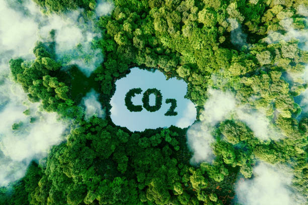

# Emisiones de CO₂ y contaminación

El dióxido de carbono es un gas incoloro, inodoro y compuesto por oxígeno y carbono. Sus emisiones son una de las principales causas del calentamiento global. Un problema causado por la actividad humana y agravado por la larga pervivencia del CO2 en la atmósfera. Ante la amenaza de una escala sin precedentes, se plantea el almacenamiento subterráneo.
