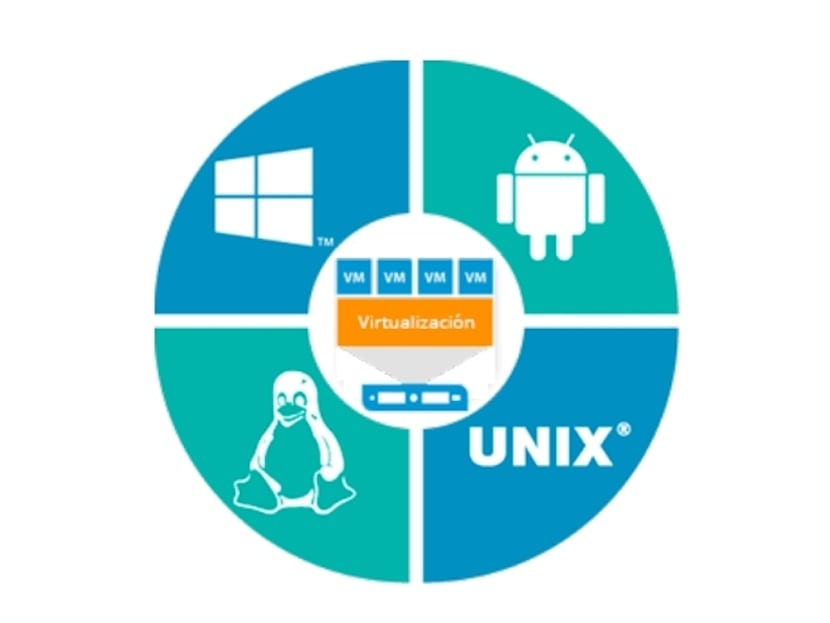

 # Optimización del hardware

 
 ### ¿Qué es la optimización del hardware y cómo contribuye a la sostenibilidad?

 La optimización del hardware se refiere al proceso de mejorar el rendimiento, la eficiencia y la vida útil de los componentes físicos de los sistemas informáticos, como servidores, computadoras, dispositivos de almacenamiento y redes.

1. Reducción del consumo energético

2. Prolongación de la vida útil del hardware

3. Disminución de la huella de carbono

4. Mejora de la eficiencia en centros de datos

 ### ¿Cómo puede la virtualización ayudar a reducir el impacto ambiental en TI?
 
  Con la virtualización, los recursos de TI se pueden asignar y compartir dinámicamente entre máquinas virtuales, asegurando que la potencia informática, el almacenamiento y las capacidades de red se utilicen al máximo. Esta reducción en el desperdicio de recursos contribuye a un entorno de TI más sostenible.
