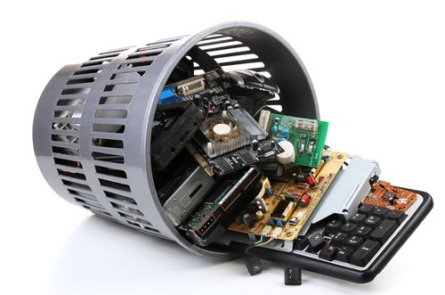

# Reciclaje electrónico

Si no reciclamos los aparatos que ya han finalizado su ciclo de vida útil, estaremos agotando los limitados recursos naturales de la Tierra. Además, algunos de los materiales con los que están fabricados los aparatos electrónicos son altamente contaminantes y tóxicos para el medio ambiente y para las personas.
